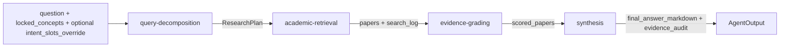

# Skill 体系与执行协议（V2.2）

> 对齐范围：`skills/*/SKILL.md`, `skills/*/CONTRACT.json`, `app/agentic/skills.py`, `app/agentic/loop.py`

## 1. 升级目标

本次升级参考结构化学术技能写法，将 PaperRank skills 从“说明型文档”升级为“可执行协议”：

1. 每个 skill 明确 `When to use / When NOT to use`。
2. 每个 skill 明确 `必要输入` 与 `工作模式决策`。
3. 每个 skill 提供 `标准输出模板` 与 `最小样例`。
4. 每个 skill 对齐 `CONTRACT.json` 做机检校验。

## 2. 四个 Skill 的统一结构

每个 `SKILL.md` 统一包含以下块：

1. 技能说明
2. 触发条件（When to use）
3. 不适用边界（When NOT to use）
4. 必要输入
5. 工作模式决策
6. 核心执行步骤
7. 质量门禁（量化）
8. 失败回退策略
9. 标准输出模板（Output Contract）
10. 最小样例

## 3. Skill 间协作协议（字段血缘）

关键字段血缘：

| 上游字段 | 下游使用位置 | 说明 |
|---|---|---|
| `ResearchPlan.sub_queries` | retrieval 入参 | 决定候选召回范围 |
| `locked_concepts` | decomposition + retrieval | 约束子查询与检索匹配 |
| `PaperRecord.query_match_score` | UI 检索解释 | 解释被召回原因 |
| `PaperRecord.rerank_score` | retrieval -> UI | 二阶段重排相关性 |
| `ScoredPaper.score.total` | synthesis 排序 | 决定证据优先级 |
| `ScoredPaper.evidence` | synthesis + audit | 支撑结论与审查 |

## 4. 合同校验机制

- 每个 skill 目录下有 `CONTRACT.json`。
- `SkillRegistry` 加载 `input_schema / output_schema`。
- `AgentLoop` 在每个阶段“执行前校验输入、执行后校验输出”。
- 校验失败时抛 `SkillContractError`，阻断错误结果传播。

## 5. 模式化执行价值

1. 减少技能漂移：不同人维护 skill 仍保持一致结构。
2. 降低黑盒风险：每步输入输出可解释、可审计。
3. 提升复用能力：模板可以直接迁移到新子任务。
4. 支持持续评测：可基于合同与样例做自动回归。

## 6. 本次变更清单

| 文件 | 变更内容 |
|---|---|
| `skills/query-decomposition/SKILL.md` | 新增触发边界、模式决策、标准输出模板、样例 |
| `skills/academic-retrieval/SKILL.md` | 同上，重点补充检索模式和日志门禁 |
| `skills/evidence-grading/SKILL.md` | 同上，重点补充证据兜底与总分可复算门禁 |
| `skills/synthesis/SKILL.md` | 同上，重点补充对齐表与审查门禁 |
| `docs/架构设计说明.md` | 新增技能写法标准与文档入口 |
| `docs/检索与评分系统详解.md` | 新增技能模式化执行说明 |
| `docs/用户使用手册.md` | 新增技能使用方式与识别指南 |

## 7. 验证方式

1. 语义验证：阅读 4 份 SKILL 均包含统一结构。
2. 运行验证：`SkillRegistry` 可正常加载全部 skill。
3. 合同验证：Loop 路径上执行 input/output schema 校验。
4. 结果验证：UI/CLI 输出与模板字段一致。
