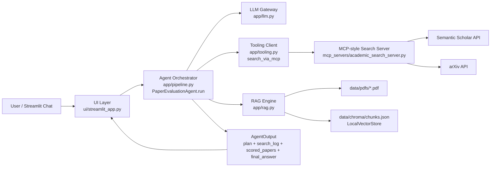
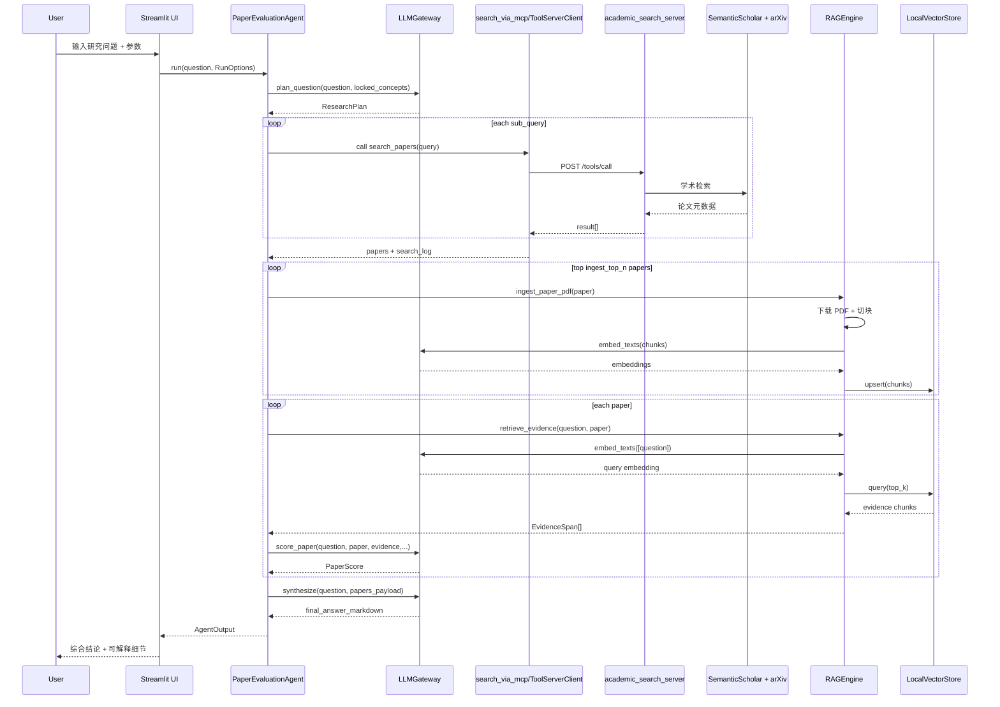
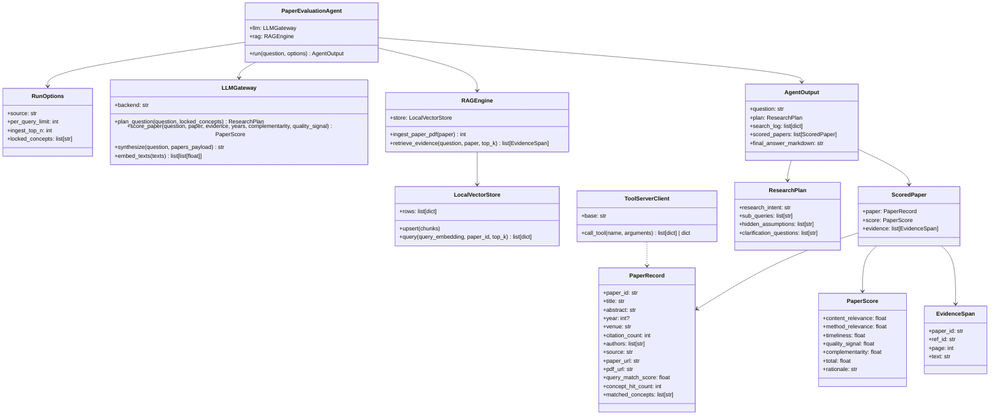

# PaperRank 架构设计说明

> 适用版本：当前仓库 `main` 分支（2026-03-22）
> 
> 目标：为 `paperrank` 项目提供一份可读、可维护、可扩展的整体架构文档，覆盖分层、数据流、时序、类关系、评分逻辑、关键设计取舍与扩展建议。

---

## 1. 项目目标与核心价值

`paperrank` 的定位是“论文搜索与综合评估智能体”：

1. 接收用户自然语言研究问题（中文/英文皆可）。
2. 自动理解问题意图并拆解为可检索子查询。
3. 通过独立 Tooling 服务检索学术论文（Semantic Scholar + arXiv）。
4. 结合全文 RAG 证据进行多维评分。
5. 输出带引用的中文综合结论（论文元信息保持英文）。

它解决的是“从问题到证据到结论”的链路问题，不是简单的论文列表检索工具。

---

## 2. 总体分层架构

### 2.1 分层概览

- `UI 层`：负责交互与可解释展示（问题拆解、检索日志、评分过程、证据表）。
- `Agent 编排层`：负责编排完整工作流，输出统一结构化结果。
- `LLM 大脑层`：负责问题理解、评分、结论综合。
- `Tooling 检索层`：独立检索服务，连接外部学术 API。
- `RAG 知识层`：全文下载、切块、向量化、相似度证据召回。
- `Schema/配置层`：统一数据模型和运行参数。

### 2.2 架构图（Mermaid）



### 2.3 目录映射

```text
paperrank/
├── app/
│   ├── config.py                # 环境变量与路径配置
│   ├── schemas.py               # 统一数据结构（Pydantic）
│   ├── prompts.py               # Prompt 模板
│   ├── llm.py                   # 规划、评分、综合、Embedding
│   ├── tooling.py               # MCP 客户端、去重排序、匹配分
│   ├── rag.py                   # PDF 下载、切块、向量检索
│   └── pipeline.py              # 主流程编排
├── mcp_servers/
│   └── academic_search_server.py # 独立检索服务
├── ui/
│   └── streamlit_app.py         # 交互界面与可解释展示
├── data/
│   ├── pdfs/                    # 已下载论文 PDF
│   └── chroma/chunks.json       # 本地向量块存储
├── run_demo.py                  # CLI 入口
└── run_mcp_server.py            # 检索服务入口
```

---

## 3. 端到端执行链路（详细）

### 3.1 主干流程

1. 用户在 UI 输入研究问题，并设置 `source / per_query_limit / ingest_top_n / locked_concepts`。
2. `PaperEvaluationAgent.run()` 调用 `LLMGateway.plan_question()` 生成研究计划。
3. 调用 `search_via_mcp()`：逐子查询调用 `search_papers` 工具，收集检索结果与日志。
4. `dedupe_papers()` 归一化、去重、计算 `query_match_score` 并排序。
5. 对前 `ingest_top_n` 篇尝试下载 PDF + 切块 + 向量化，针对每篇召回证据片段。
6. `score_paper()` 输出五维评分并计算总分。
7. `synthesize()` 根据论文卡片输出结构化中文报告。
8. UI 展示：答案、检索日志、论文列表、匹配分、评分过程、证据表、澄清重跑入口。

### 3.2 时序图（Mermaid）



---

## 4. 关键类图（Mermaid）



---

## 5. 核心模块详解

### 5.1 UI 层（`ui/streamlit_app.py`）

**职责**
- 提供聊天式输入。
- 展示 Planner（研究意图、子查询、隐含前提、澄清问题）。
- 展示检索日志与论文列表。
- 展示查询匹配分与评分过程明细。
- 提供“人工锁定关键概念”与“澄清后重跑”能力。

**关键点**
- 默认中文界面。
- 论文标题/摘要/链接保留英文。
- 对旧 Session 做字段兼容（`query_match_score` 等）。

### 5.2 编排层（`app/pipeline.py`）

**职责**
- 把多模块串成一条稳定可运行链路。

**关键逻辑**
1. `plan_question()` 先拆解问题。
2. `search_via_mcp()` 拉回候选论文。
3. 候选为空时返回“无证据”结果。
4. 否则计算互补性、逐篇构建证据、逐篇评分。
5. 组装论文卡片，调用 `synthesize()` 生成最终报告。

### 5.3 LLM 层（`app/llm.py` + `app/prompts.py`）

**职责**
- 问题理解与拆解。
- 单篇论文评分。
- 最终综合写作。

**设计特点**
- `openai` 与 `mock` 双后端。
- “LLM 方案 + 规则兜底”混合策略，避免跑偏。
- `locked_concepts` 会被规范化并强制注入子查询。
- 对研究意图文本进行强制重写，确保与问题对齐。

### 5.4 Tooling 检索层（`app/tooling.py` + `mcp_servers/academic_search_server.py`）

**职责**
- 独立进程化检索服务。
- 统一处理 arXiv / Semantic Scholar。
- 结果归一化、去重、匹配排序。

**关键机制**
- `ToolServerClient` 动态端口启动本地服务。
- `search_papers` 支持 `source` 与 `locked_concepts`。
- arXiv 查询做结构化拼接；Semantic Scholar 有 429 重试。
- 检索后在本地做语义/概念重排，而非完全依赖外部 API 排序。

### 5.5 RAG 层（`app/rag.py`）

**职责**
- 论文 PDF 下载缓存。
- 文本切块与向量化。
- 针对单篇论文检索证据段落。

**实现说明**
- PDF 解析使用 `PyMuPDF(fitz)`。
- 向量库是本地轻量存储 `chunks.json`（并非独立服务）。
- 相似度采用余弦相似度。

### 5.6 Schema 与配置层（`app/schemas.py` + `app/config.py`）

**职责**
- 保证全链路数据结构稳定。
- 处理空值/异常值规范化。
- 从环境变量注入模型、路径、参数。

---

## 6. 检索与评分体系（重点）

### 6.1 检索阶段：查询-论文匹配分

在 `dedupe_papers()` 中计算：

```text
query_match_score = concept_hit_count * 1.0 + relevance_score + lock_match_count * 1.5
```

含义：
1. `concept_hit_count`：命中的概念组数量。
2. `relevance_score`：问题/子查询锚点词与论文文本词项覆盖度 + 技术短语 bonus。
3. `lock_match_count`：命中“人工锁定概念”的数量（权重更高）。

用途：
- 用于候选筛选和排序优先级。
- 不等于最终综合评分。

### 6.2 最终阶段：多维总分

`score_paper()` 最终总分：

```text
total = 0.35*content_relevance
      + 0.25*method_relevance
      + 0.15*timeliness
      + 0.15*quality_signal
      + 0.10*complementarity
```

维度说明：
1. `content_relevance`：是否直接回答研究问题。
2. `method_relevance`：方法/实验设置是否可迁移。
3. `timeliness`：时效性。
4. `quality_signal`：由引文、venue、作者数量推断的质量先验。
5. `complementarity`：与其他论文的互补性（避免全是同质论文）。

### 6.3 quality_signal 计算

```text
citation_signal = min(100, citation_count/300*100)
venue_signal = 70 if venue!=arXiv else 50
author_signal = min(100, 40 + 8*author_count)
quality_signal = 0.45*citation_signal + 0.35*venue_signal + 0.20*author_signal
```

### 6.4 complementarity 计算

- 为每篇论文抽取 token 集。
- 与其他论文做两两 Jaccard 相似度。
- 取平均相似度后转为互补性：

```text
complementarity = (1 - mean_similarity) * 100
```

---

## 7. 关键设计取舍与边界

### 7.1 为什么做独立 Tooling 服务

- 将检索能力与 Agent 主逻辑解耦。
- 便于后续替换更多数据源（OpenAlex、CrossRef、ACL Anthology）。
- 便于单独调试检索层问题。

### 7.2 为什么需要“规则兜底”

- 纯 LLM 拆解可能跑偏。
- 规则兜底保证最小可用与稳定召回。
- 再通过覆盖率评分在 LLM 方案与规则方案之间选择更优者。

### 7.3 当前局限

1. 本地向量存储是 JSON 文件，规模大时性能有限。
2. `locked_concepts` 当前是“检索增强约束”，不是严格布尔检索引擎。
3. 评分依赖 LLM 输出质量，仍需人工复核关键结论。
4. 未引入异步批量向量化和缓存淘汰策略。

---

## 8. 可扩展路线

1. 向量层升级为 Chroma/Qdrant/FAISS 持久化方案。
2. 增加“检索质量评估器”（Recall@K、Intent Coverage）。
3. 引入重排模型（cross-encoder）替代纯词项规则。
4. 增加结果可追溯页面（每条结论绑定证据链）。
5. 引入多智能体评审（检索代理、评分代理、审稿代理）。

---

## 9. 运行与调试建议

### 9.1 常用入口

```bash
# 启动 UI
streamlit run ui/streamlit_app.py

# CLI 跑通主链路
python run_demo.py "Do rerankers improve RAG reliability in enterprise QA?"

# 单独启动检索服务
python run_mcp_server.py
```

### 9.2 重点观察点

1. Planner 输出是否与问题意图一致。
2. `search_log` 是否显示某些子查询持续 0 hit。
3. `query_match_score` 与最终 `total` 是否出现明显冲突。
4. 证据片段页码是否可支撑关键结论。

---

## 10. 一句话总结

`paperrank` 当前是一个“以问题为中心”的论文分析系统：
它通过“意图拆解 + 学术检索 + 全文证据 + 多维评分 + 结构化综合回答”形成闭环，并在 UI 中提供可解释过程，兼顾可用性与可扩展性。
