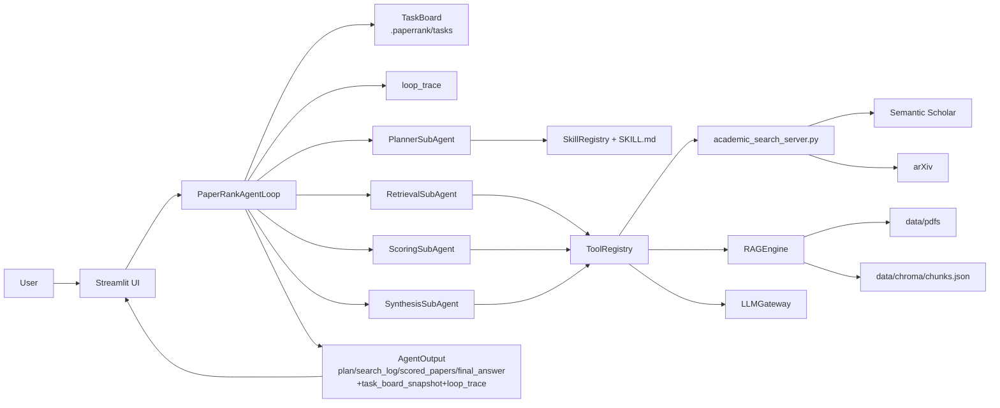

# PaperRank 架构设计说明（V2 Agentic 重构版）

> 对齐代码版本：`main`（2026-03-22）  
> 对齐目录：`app/agentic/`, `app/`, `mcp_servers/`, `ui/`

---

## 1. 本次重构目标与结果

为解决“流程逻辑分散、职责边界不清、难以扩展”问题，项目已从“单体线性 pipeline”重构为标准智能体框架：

1. `agent loop`：显式主循环编排。
2. `tools`：统一工具注册与调用。
3. `skills`：可加载的领域技能层。
4. `subagents`：角色化执行单元。
5. `task system`：持久化任务系统（流程外置状态）。

重构后保持了原有业务能力（检索 + 评分 + 综合回答），并新增了可追踪执行轨迹与任务看板。

---

## 2. 具体修改清单（从旧到新）

| 领域 | 修改前 | 修改后 |
|---|---|---|
| 主流程编排 | `pipeline.py` 内部串行逻辑 | `PaperRankAgentLoop` 统一编排（`app/agentic/loop.py`） |
| 工具调用 | 分散在业务代码中直接调用函数 | `ToolRegistry` 统一注册与调用（`app/agentic/tools.py`） |
| 技能知识 | 无结构化技能层 | `SkillRegistry` + `skills/*/SKILL.md` |
| 子代理 | 无显式角色边界 | `Planner/Retriever/Scorer/Synthesizer` 四类 SubAgent |
| 任务状态 | 仅内存态 | `.paperrank/tasks/task_*.json` 持久化任务板 |
| 输出结构 | 基础结果 | 新增 `task_board_snapshot`、`loop_trace` |
| UI 可解释性 | 评分细节为主 | 新增 Agent Loop / Task System 可视化 |

---

## 3. 分层架构

### 3.1 分层说明

1. `UI 层`（`ui/streamlit_app.py`）  
- 用户输入、参数设置、日志与结果展示。

2. `Agentic 编排层`（`app/agentic/loop.py`）  
- 控制任务依赖、子代理执行顺序、全程 trace。

3. `SubAgent 执行层`（`app/agentic/subagents.py`）  
- Planner / Retriever / Scorer / Synthesizer 各司其职。

4. `Tools 层`（`app/agentic/tools.py`）  
- 将检索、RAG、评分、综合能力封装为可调用工具。

5. `Skills 层`（`app/agentic/skills.py` + `skills/`）  
- 通过 SKILL.md 注入角色方法论。

6. `Task System`（`app/agentic/tasks.py`）  
- 持久化任务状态，支持流程可恢复与可审计。

7. `Domain 核心层`（`app/llm.py`, `app/tooling.py`, `app/rag.py`, `mcp_servers/`）  
- 问题拆解、学术检索、PDF证据、评分与综合回答。

### 3.2 架构图（Mermaid）



---

## 4. Agent Loop 设计

入口：`PaperRankAgentLoop.run(question, options)`

执行顺序：
1. 创建 root task，并置为 `in_progress`。
2. 创建 4 个子任务（decomposition / retrieval / scoring / synthesis）。
3. 调 Planner 生成 `ResearchPlan`。
4. 调 Retriever 通过 `search_batch` 工具检索候选论文。
5. 调 Scorer 执行 PDF ingest、证据召回与五维评分。
6. 调 Synthesizer 生成最终中文 Markdown 回答。
7. 更新任务状态为 completed，并输出 `task_board_snapshot + loop_trace`。

### 4.1 任务依赖链

```text
#1 PaperRank run
 └─ #2 Question decomposition
     └─ #3 Academic retrieval
         └─ #4 Evidence scoring
             └─ #5 Final synthesis
```

### 4.2 Loop Trace 字段

每条 trace 含：
- `time`
- `stage`（config/planner/retrieval/scoring/synthesis/loop）
- `message`
- `details`

---

## 5. SubAgent 定义

| SubAgent | 文件 | 职责 | 输入 | 输出 |
|---|---|---|---|---|
| PlannerSubAgent | `app/agentic/subagents.py` | 研究意图与子查询拆解 | `question`, `locked_concepts` | `ResearchPlan` |
| RetrievalSubAgent | 同上 | 多源检索与日志聚合 | `plan`, `source`, `per_query_limit` | `papers`, `search_log` |
| ScoringSubAgent | 同上 | 证据构建与多维评分 | `papers`, `ingest_top_n` | `ScoredPaper[]` |
| SynthesisSubAgent | 同上 | 最终中文综合回答 | `scored_papers`, `plan` | `final markdown` |

---

## 6. Tools 定义（重构后）

定义文件：`app/agentic/tools.py`

| Tool | 输入 | 输出 | 绑定能力 |
|---|---|---|---|
| `search_batch` | `question, sub_queries, source, per_query_limit, locked_concepts` | `(papers, search_log)` | `search_via_mcp` |
| `ingest_pdf` | `paper` | `chunk_count` | `RAGEngine.ingest_paper_pdf` |
| `retrieve_evidence` | `question, paper, top_k` | `EvidenceSpan[]` | `RAGEngine.retrieve_evidence` |
| `score_single` | `question, paper, evidence_snippets, years, complementarity, quality_signal` | `PaperScore` | `LLMGateway.score_paper` |
| `synthesize` | `question, papers_payload` | `markdown` | `LLMGateway.synthesize` |

工具调用机制：
1. `ToolRegistry.register(name, description, handler)` 注册。
2. `ToolRegistry.call(name, **kwargs)` 统一调度（支持 async/sync）。
3. SubAgent 不直接耦合底层实现，只通过 ToolRegistry 调用。

---

## 7. Skills 定义（重构后）

技能加载：`app/agentic/skills.py`  
技能目录：`skills/*/SKILL.md`

frontmatter 格式：

```yaml
---
name: query-decomposition
description: 将研究问题拆解为高召回且高精度的英文子查询。
tags: planner,query,intent,decomposition
---
```

当前技能清单：

| Skill 名称 | 文件 | 核心作用 | 绑定 SubAgent |
|---|---|---|---|
| `query-decomposition` | `skills/query-decomposition/SKILL.md` | 限制子查询质量与意图覆盖 | Planner |
| `academic-retrieval` | `skills/academic-retrieval/SKILL.md` | 检索策略与召回稳健性 | Retriever |
| `evidence-grading` | `skills/evidence-grading/SKILL.md` | 证据驱动评分约束 | Scorer |
| `synthesis` | `skills/synthesis/SKILL.md` | 引用化综合回答规范 | Synthesizer |

SkillRegistry 提供：
- `descriptions_text()`：技能摘要（轻量注入）
- `render_skill(name)`：完整技能体（按需加载）

---

## 8. Task System 设计

实现：`app/agentic/tasks.py`

### 8.1 持久化格式

存储目录：`.paperrank/tasks/`  
单任务文件：`task_{id}.json`

核心字段：
- `id`
- `title`
- `assignee`
- `status`（`pending/in_progress/completed/failed`）
- `depends_on`
- `payload`
- `result_summary`
- `error`
- `created_at`, `updated_at`

### 8.2 设计价值

1. 状态外置：即使会话压缩，任务状态仍可追踪。
2. 过程可审计：便于复盘每步执行与失败点。
3. 易扩展：后续可支持重试、回滚、并行任务调度。

---

## 9. 数据模型变更

`app/schemas.py` 中 `AgentOutput` 新增：

- `task_board_snapshot: List[dict]`
- `loop_trace: List[dict]`

兼容性：
- 原有字段保持不变（`plan`, `search_log`, `scored_papers`, `final_answer_markdown`）。
- 旧调用代码无需改动，新增字段可选消费。

---

## 10. UI 与 CLI 变化

### 10.1 UI 新增

`ui/streamlit_app.py` 新增展示区：
1. `Agent Loop / Task System`
2. 任务看板表格
3. 执行轨迹表格
4. Tools / Skills 定义展开面板

### 10.2 CLI 新增

`run_demo.py` 新增：
1. `=== Task System ===` 输出
2. `=== Agent Loop Trace ===` 输出

---

## 11. 兼容与风险

### 11.1 已保持兼容

- 外部入口不变：`PaperEvaluationAgent.run()`、`RunOptions`。
- UI/CLI 调用方式不变。

### 11.2 当前风险点

1. 任务系统目前为单机文件版，不支持分布式并发写入。
2. SubAgent 当前是职责隔离，尚未并行执行。
3. Skills 目前是“规范层”，可进一步升级为动态策略器输入。

---

## 12. 一句话总结

本次重构已将 PaperRank 从“功能可用”升级为“结构清晰、职责明确、可持续扩展”的标准智能体框架，核心体现为：`agent loop + tools + skills + subagents + task system` 五要素完整落地。
