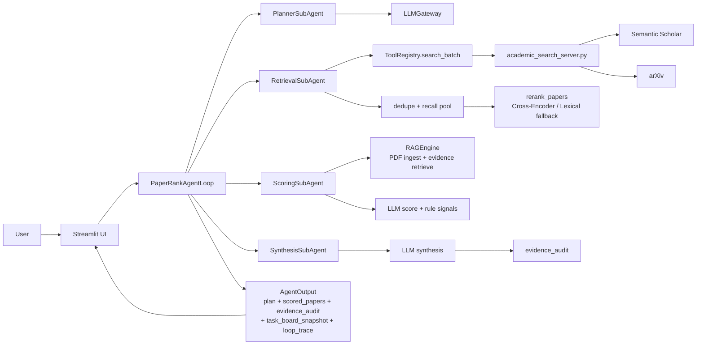
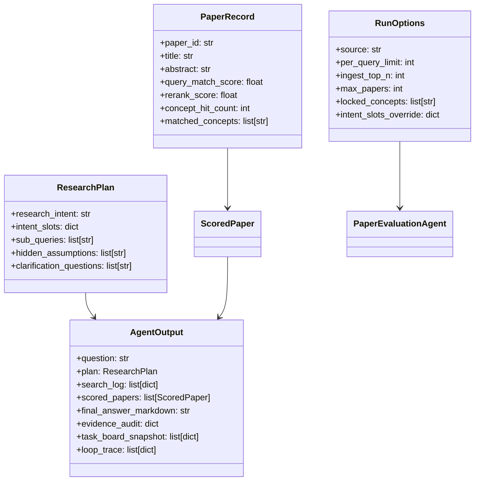

# PaperRank 架构设计说明（V2.1 三项优先增强版）

> 对齐代码分支：`main`  
> 对齐日期：2026-03-22  
> 对齐范围：`app/`, `app/agentic/`, `ui/`, `docs/`

---

## 1. 本轮三项优先增强（已落地）

1. **两阶段检索重排（Recall 100 -> Rerank <= 30）**  
- 第一阶段：扩大召回池，目标约 100 条候选。  
- 第二阶段：交叉编码器重排（不可用时自动回退 lexical 重排）。  
- 输出新增 `rerank_score`，并在 UI 展示。

2. **结构化意图槽位（Intent Slots）可编辑并重跑**  
- Planner 输出 `subject/intervention/outcome/context/evaluation`。  
- UI 支持人工编辑槽位并一键重跑。  
- 支持 `RunOptions.intent_slots_override` 全链路透传。

3. **证据约束综合与审查（Evidence Audit）**  
- 综合生成后执行引用审查：关键结论是否带 `[P#]`，引用编号是否有效，是否有证据片段。  
- 输出新增 `evidence_audit`，并在 UI 与 CLI 展示。  
- 审查不通过时自动附加“证据对齐审查”段落。

---

## 2. 分层架构

1. **UI 层**：`ui/streamlit_app.py`  
2. **Agentic 编排层**：`app/agentic/loop.py`  
3. **SubAgent 执行层**：`app/agentic/subagents.py`  
4. **Tools 层**：`app/agentic/tools.py`  
5. **Domain 核心层**：`app/llm.py`, `app/tooling.py`, `app/rerank.py`, `app/rag.py`  
6. **MCP Tool Server 层**：`mcp_servers/academic_search_server.py`  
7. **Task System**：`app/agentic/tasks.py`, `.paperrank/tasks/`

---

## 3. 架构图



---

## 4. 时序图（本轮新增逻辑）

```mermaid
sequenceDiagram
    participant User
    participant UI
    participant Loop
    participant Planner
    participant Retriever
    participant MCP
    participant Rerank
    participant Scorer
    participant Synth

    User->>UI: 输入研究问题 + 参数
    UI->>Loop: run(question, options)

    Loop->>Planner: plan_question(question, locked_concepts, intent_slots_override)
    Planner-->>Loop: ResearchPlan(intent_slots, sub_queries)

    Loop->>Retriever: search_batch(question, sub_queries,...)
    Retriever->>MCP: search_papers(query_i, effective_limit)
    MCP-->>Retriever: raw candidates
    Retriever->>Rerank: dedupe(recall_pool≈100) + rerank(top_k<=30)
    Rerank-->>Retriever: papers(rerank_score)
    Retriever-->>Loop: papers + search_log

    Loop->>Scorer: ingest_pdf + retrieve_evidence + score_single
    Scorer-->>Loop: scored_papers

    Loop->>Synth: synthesize(question, papers_payload)
    Synth->>Synth: evidence_audit(check citations)
    Synth-->>Loop: final_answer + evidence_audit

    Loop-->>UI: AgentOutput
    UI-->>User: 结果流 + 评分过程 + 证据审查
```

---

## 5. 类图（关键对象）



---

## 6. Tools / SubAgents / Skills 的职责边界

### 6.1 SubAgents

| SubAgent | 核心职责 | 关键新增 |
|---|---|---|
| `PlannerSubAgent` | 理解问题，拆解子查询 | 支持 `intent_slots_override` |
| `RetrievalSubAgent` | MCP 检索 + 去重重排 | 两阶段检索 + `rerank_score` |
| `ScoringSubAgent` | 证据构建 + 五维评分 | 与旧版一致（承接新候选集） |
| `SynthesisSubAgent` | 中文综合回答 + 引用 | 新增 `evidence_audit` |

### 6.2 Tools

| Tool | 对应实现 |
|---|---|
| `search_batch` | `app/tooling.py::search_via_mcp` |
| `ingest_pdf` | `app/rag.py::ingest_paper_pdf` |
| `retrieve_evidence` | `app/rag.py::retrieve_evidence` |
| `score_single` | `app/llm.py::score_paper` |
| `synthesize` | `app/llm.py::synthesize` |

---

## 7. 可追溯变更表（本轮）

| 文件 | 变更点 | 验证方式 |
|---|---|---|
| `app/rerank.py` | 新增交叉编码器/词法回退重排 | `run_demo.py` 输出含 `rerank_score` |
| `app/tooling.py` | 召回池扩大 + 0命中简化重试 + 后置重排 + postprocess 日志 | 检索日志含 `__postprocess__` 行 |
| `app/config.py` | 新增 `SEARCH_RECALL_POOL/RERANK_*` 配置 | `.env.example` 对齐 |
| `app/llm.py` | `forced_intent_slots` 合并与槽位输出 | UI“问题理解与拆解”可看到并可改 |
| `app/pipeline.py` | `RunOptions.intent_slots_override` | UI/CLI 可透传槽位覆盖 |
| `app/agentic/loop.py` | 透传槽位覆盖 + 汇总 `evidence_audit` | `AgentOutput.evidence_audit` 可见 |
| `app/agentic/subagents.py` | 合成后证据审查与降级标记 | 综合结果末尾可见审查段落 |
| `ui/streamlit_app.py` | 展示 `rerank_score`、槽位重跑、证据审查面板 | Streamlit 页面可交互验证 |
| `run_demo.py` | 新增 `--intent-slots-json` + 证据审查打印 | CLI 一次命令验证 |
| `docs/*.md` | 架构/评分/手册同步更新 | 文档与代码字段一致 |

---

## 8. 运行验证（建议命令）

```bash
python3 -m compileall app ui run_demo.py
./.venv/bin/python run_demo.py "How to model LLM agent task execution with MDP and improve efficiency?" \
  --source all --per-query-limit 6 --max-papers 30 \
  --locked-concepts "deep learning, agent, task execution, llm"
```

成功判据：
- 检索日志包含 `__postprocess__`。  
- 候选论文数量 `<=30` 且通常 `>8`。  
- 评分输出出现 `rerank=`。  
- 输出包含 `=== 证据审查 ===`。

---

## 9. 当前边界

1. Cross-Encoder 首次运行需要下载模型，网络慢时会自动回退 lexical。  
2. Semantic Scholar 限流时召回可能下降。  
3. 证据审查当前为规则审查（引用格式/映射），非事实真伪判定器。
